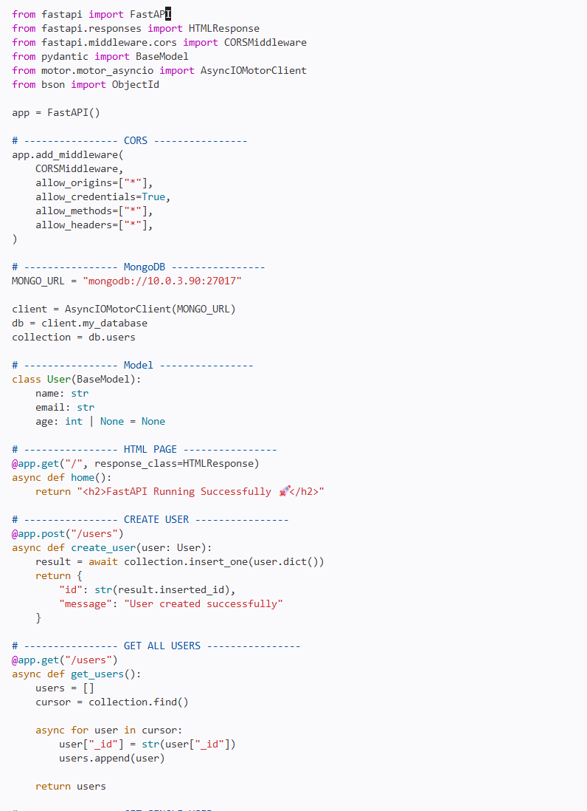
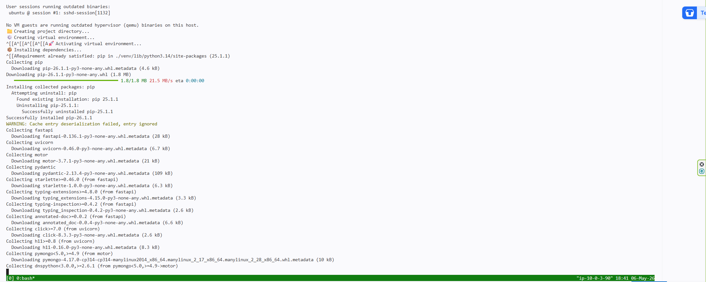
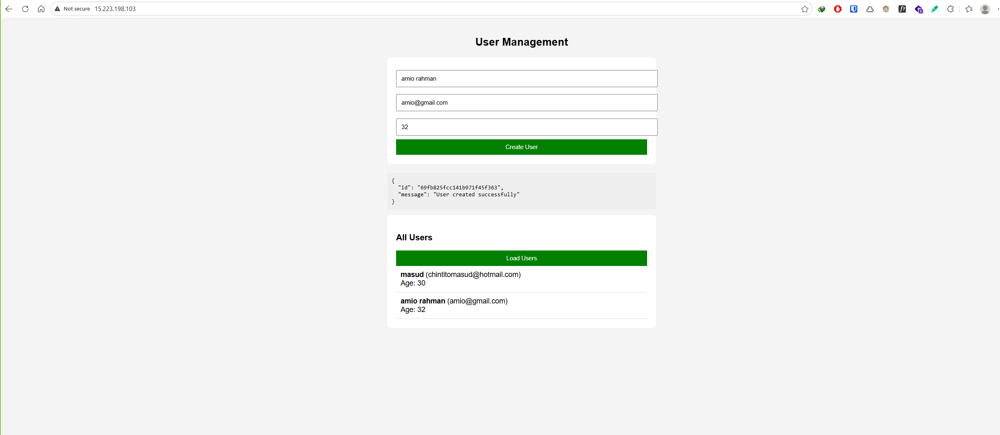
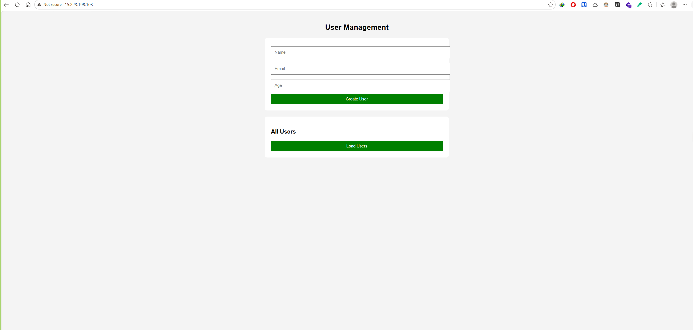
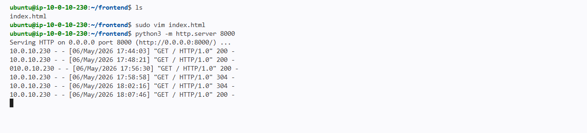
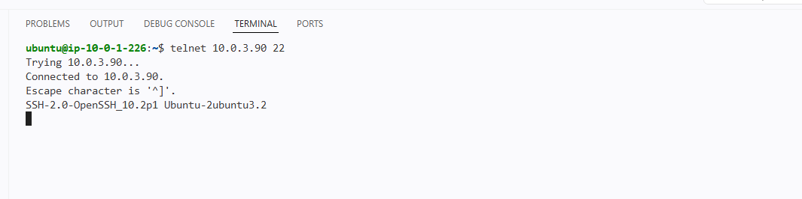
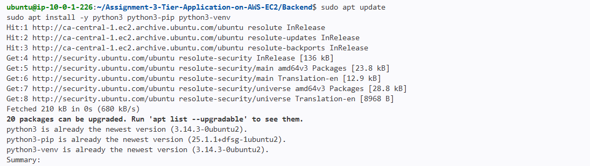

# 📄 README: 3-Tier Application Deployment on AWS EC2

> **Assignment Submission** | **Author: Masudur Rahman**  
> **Repository:** https://github.com/chintitomasud3/Assignment-3-Tier-Application-on-AWS-EC2  
> **Date:** `7 May 2026`

---

## 🎯 Objective
Design and deploy a scalable 3-tier web application on AWS EC2 with proper separation of concerns:
- **Presentation Layer**: Nginx + Python `http.server` Frontend (Port 8000)
- **Application Layer**: FastAPI (Python) Backend (Port 9000)
- **Data Layer**: MongoDB Database (Port 27017)

---

## 🧱 Architecture Overview

```
┌─────────────────────────────────────────────────────┐
│            PRESENTATION LAYER                        │
│  ┌─────────────────────────────────────────┐       │
│  │  EC2: Nginx + Python http.server        │       │
│  │  Private IP: 10.0.10.230                │       │
│  │  Public IP: 15.223.198.103:80 ✓         │       │
│  │                                         │       │
│  │  Nginx Routing:                         │       │
│  │  • /       → http://10.0.10.230:8000   │       │
│  │  • /api/   → http://10.0.1.226:9000    │       │
│  └─────────────────────────────────────────┘       │
└─────────────────┬───────────────────────────────────┘
                  │ proxy_pass /api/
                  ▼
┌─────────────────────────────────────────────────────┐
│            APPLICATION LAYER                         │
│  ┌─────────────────────────────────────────┐       │
│  │  EC2: FastAPI Backend                   │       │
│  │  Private IP: 10.0.1.226:9000            │       │
│  │  Public Access: ✗ (Private Only)        │       │
│  │                                         │       │
│  │  • REST API with CRUD operations        │       │
│  │  • Async MongoDB via Motor              │       │
│  └─────────────────────────────────────────┘       │
└─────────────────┬───────────────────────────────────┘
                  │ motor (async)
                  ▼
┌─────────────────────────────────────────────────────┐
│              DATA LAYER                              │
│  ┌─────────────────────────────────────────┐       │
│  │  EC2: MongoDB 7.0                       │       │
│  │  Private IP: 10.0.13.224:27017          │       │
│  │  Public Access: ✗ (Private Only)        │       │
│  │                                         │       │
│  │  • NoSQL database for user data         │       │
│  │  • Bound to private network             │       │
│  └─────────────────────────────────────────┘       │
└─────────────────────────────────────────────────────┘
```

> 🔐 **Network Design**: Public access only via Nginx (port 80). Backend & Database communicate via private IPs only.

---

## 📋 Prerequisites

| Component | Requirement |
|-----------|------------|
| AWS Account | EC2 access with `t2.micro` or higher |
| SSH Client | Key pair (.pem file) for instance access |
| Local Machine | Git, Terminal, Browser, curl |
| OS | **Ubuntu Server 26.04 LTS** |
| Security Groups | Configured as per section below |

---

## ⚙️ Setup Steps

### 🔹 Step 1: Launch 3 EC2 Instances (Ubuntu 26.04 LTS)

| Instance | Role | Private IP | Public IP | Security Group |
|----------|------|------------|-----------|---------------|
| `ec2-presentation` | Nginx + Frontend | `10.0.10.230` | `15.223.198.103` | `80/tcp` from `0.0.0.0/0`, `22/tcp` from your IP |
| `ec2-application` | FastAPI Backend | `10.0.1.226` | `✗` | `9000/tcp` from `10.0.10.230`, `22/tcp` from your IP |
| `ec2-data` | MongoDB | `10.0.13.224` | `✗` | `27017/tcp` from `10.0.1.226`, `22/tcp` from your IP |

---

### 🔹 Step 2: Configure Data Layer (MongoDB) 🗄️

**SSH into `ec2-data` **(10.0.13.224):
```bash
ssh -i "your-key.pem" ubuntu@10.0.13.224
```

#### 🧩 MongoDB Installation Steps (Ubuntu 26.04):

```bash
# 🔄 1. System Update
sudo apt-get update

# 📦 2. Add MongoDB Repository
echo "deb [ arch=amd64,arm64 signed-by=/usr/share/keyrings/mongodb-server-7.0.gpg ] https://repo.mongodb.org/apt/ubuntu noble/mongodb-org/7.0 multiverse" | \
sudo tee /etc/apt/sources.list.d/mongodb-org-7.0.list

# 🔑 3. Add GPG Key
sudo rm -f /usr/share/keyrings/mongodb-server-7.0.gpg
curl -fsSL https://pgp.mongodb.com/server-7.0.asc | \
sudo gpg --dearmor -o /usr/share/keyrings/mongodb-server-7.0.gpg

# 🔄 4. Update Package List Again
sudo apt update

# ⬆️ 5. Upgrade System (Optional but recommended)
sudo apt-get upgrade -y

# 📥 6. Install MongoDB
sudo apt install -y mongodb-org

# 🚀 7. Start MongoDB Service
sudo systemctl start mongod

# ✅ 8. Enable Auto Start
sudo systemctl enable mongod

# 📊 9. Check Status
sudo systemctl status mongod --no-pager

# 🌐 10. Allow Remote Access (Edit config)
sudo nano /etc/mongod.conf
# Change: bindIp: 127.0.0.1  →  bindIp: 0.0.0.0

# 🔁 11. Restart MongoDB
sudo systemctl restart mongod

# 🧪 12. Test MongoDB Shell
mongosh --eval "db.adminCommand('ping')"
```

✅ **Expected Output**: `{ ok: 1 }`

> ⚠️ **Security Note**: `bindIp: 0.0.0.0` is used for assignment purposes. In production, restrict to backend private IP only: `bindIp: 10.0.1.226`.

---

### 🔹 Step 3: Configure Application Layer (FastAPI) ⚡

**SSH into `ec2-application` **(10.0.1.226):

#### 🐍 Clone Repository & Setup Backend:

```bash
# 🔄 Update system
sudo apt update

# 🐍 Install Python & Git (Python 3.12+ pre-installed on Ubuntu 26.04)
sudo apt install -y python3-pip python3-venv git

# 📦 Clone the assignment repository
git clone https://github.com/chintitomasud3/Assignment-3-Tier-Application-on-AWS-EC2.git
cd Assignment-3-Tier-Application-on-AWS-EC2/backend

# ⚙️ Create virtual environment
python3 -m venv venv

# 🚀 Activate virtual environment
source venv/bin/activate

# 📦 Install dependencies from requirements.txt
pip install --upgrade pip
pip install -r requirements.txt
# OR install manually if no requirements.txt:
# pip install fastapi uvicorn motor pydantic

# ▶️ Start the FastAPI Server
uvicorn main:app --host 0.0.0.0 --port 9000
```

✅ **Verification**:
```bash
curl http://localhost:9000/
# Output: <h2>FastAPI Running Successfully 🚀</h2>

curl http://localhost:9000/users
# Output: []
```

> 🔧 **Important**: Update `MONGO_URL` in `backend/main.py` to match your DB private IP:
```python
MONGO_URL = "mongodb://10.0.13.224:27017"  # ✅ Match your MongoDB instance
```

---

### 🔹 Step 4: Configure Presentation Layer (Nginx + Python http.server) 🌐

**SSH into `ec2-presentation` **(10.0.10.230):

#### 4.1 Install & Configure Nginx
```bash
sudo apt update && sudo apt install -y nginx
sudo nano /etc/nginx/nginx.conf  # Paste the config below
sudo nginx -t && sudo systemctl restart nginx
```

#### 📄 Nginx Configuration (`/etc/nginx/nginx.conf`):
```nginx
worker_processes 1;
events { worker_connections 1024; }

http {
    include /etc/nginx/mime.types;
    default_type application/octet-stream;

    # Frontend upstream (same instance - Python http.server)
    upstream frontend_server {
        server 10.0.10.230:8000;
    }

    # Backend upstream (separate instance - FastAPI)
    upstream backend_server {
        server 10.0.1.226:9000;
    }

    server {
        listen 80;
        server_name _;

        # Frontend route - proxy to Python http.server
        location / {
            proxy_pass http://frontend_server;
            proxy_set_header Host $host;
            proxy_set_header X-Real-IP $remote_addr;
            proxy_set_header X-Forwarded-For $proxy_add_x_forwarded_for;
        }

        # Backend API route - proxy to FastAPI
        location /api/ {
            proxy_pass http://backend_server/;
            proxy_set_header Host $host;
            proxy_set_header X-Real-IP $remote_addr;
            proxy_set_header X-Forwarded-For $proxy_add_x_forwarded_for;
            client_max_body_size 20M;
        }
    }
}
```

#### 4.2 Clone Repository & Start Frontend using Python `http.server` (Port 8000)

> 💡 **Important**: `http.server` is a **built-in Python module** — **NO pip installation required!** ✅

```bash
# 🔄 Update system
sudo apt update

# 🐍 Install Git (Python 3.12+ already included in Ubuntu 26.04)
sudo apt install -y git

# 📦 Clone the assignment repository
git clone https://github.com/chintitomasud3/Assignment-3-Tier-Application-on-AWS-EC2.git
cd Assignment-3-Tier-Application-on-AWS-EC2/frontend

# 🚀 Start Python built-in HTTP server on port 8000
# This serves static HTML/CSS/JS files - NO INSTALLATION NEEDED!
python3 -m http.server 8000 --bind 10.0.10.230
```

✅ **Verification**:
```bash
curl http://10.0.10.230:8000
# Expected: HTML content from frontend/index.html or similar

# Or test in browser:
# http://10.0.10.230:8000
```


---

## 🔐 Security Group Configuration (Critical!)

| Instance | Port | Protocol | Source | Purpose |
|----------|------|----------|--------|---------|
| `ec2-presentation` | 80 | TCP | `0.0.0.0/0` | Public HTTP access |
| `ec2-presentation` | 22 | TCP | Your IP | SSH management |
| `ec2-presentation` | 8000 | TCP | `127.0.0.1/32` | Frontend local access |
| `ec2-application` | 9000 | TCP | `10.0.10.230/32` | Backend API (Nginx only) |
| `ec2-application` | 22 | TCP | Your IP | SSH management |
| `ec2-data` | 27017 | TCP | `10.0.1.226/32` | MongoDB (Backend only) |
| `ec2-data` | 22 | TCP | Your IP | SSH management |

> 🛡️ **Principle of Least Privilege**: Database and backend are NOT publicly accessible.

---

## 🌐 Application Access & Testing

### ✅ Access the Application
```
http://15.223.198.103/
```
➡️ **Loads frontend** from `10.0.10.230:8000` via Nginx proxy

### ✅ Test API via Nginx Proxy
```
http://15.223.198.103/api/users
```
➡️ **Proxied to backend** at `10.0.1.226:9000`

### ✅ Full Flow Test (curl)

```bash
# 1. Test frontend loads via Nginx
curl http://15.223.198.103/
# Expected: HTML frontend content

# 2. Test API endpoint via proxy
curl http://15.223.198.103/api/users
# Expected: [] (empty array)

# 3. Create a user via proxied API
curl -X POST http://15.223.198.103/api/users \
  -H "Content-Type: application/json" \
  -d '{"name": "Masudur Rahman", "email": "mrahman021992@gmail.com", "age": 34}'

# Expected Response:
{
  "id": "65f8a1b2c3d4e5f6a7b8c9d0",
  "message": "User created successfully"
}

# 4. Verify user was saved in MongoDB
curl http://15.223.198.103/api/users
# Expected: Array containing the newly created user
```

---


## 📸 Screenshots (Proof of Work)

# Screenshots

## Backend Code


## Backend Server Installation


## Frontend Data Entry With Status


## Frontend Page


## Frontend Server


## Telnet Connectivity


## Upgradation



> 📌 *Replace placeholders below with actual screenshots from your deployment*


---

## 🗂️ Repository Structure

```
Assignment-3-Tier-Application-on-AWS-EC2/
├── README.md                          # This file
├── Backend/
│   ├── main.py                        # FastAPI application code
│   ├── requirements.txt               # Python dependencies
│                      
├── frontend/
│   ├── index.html                     # Main frontend page
│   ├── css/                           # Stylesheets
│   ├── js/                            # JavaScript files
│   └── (other static assets)

```

---

## 🛠️ Troubleshooting Guide

| Issue | Possible Cause | Solution |
|-------|---------------|----------|
| Frontend not loading on `/` | Python http.server not running | Check `python3 -m http.server 8000 --bind 10.0.10.230` |
| `502 Bad Gateway` on `/api/` | Backend unreachable | Verify backend running + SG allows `10.0.10.230` → `10.0.1.226:9000` |
| MongoDB connection error | Wrong IP or SG blocked | Check `MONGO_URL` + SG allows `10.0.1.226` → `10.0.13.224:27017` |
| Nginx config error | Syntax issue | Run `sudo nginx -t` before restart |
| CORS errors | Missing middleware | Ensure `CORSMiddleware` is configured in `main.py` |
| Git clone fails | Network or auth issue | Verify internet access + use HTTPS URL |
| `python3: command not found` | Python not installed | Ubuntu 26.04 includes Python 3.12+ by default |

**Quick Network Tests**:
```bash
# From presentation instance:
curl http://10.0.10.230:8000          # Test frontend locally
curl http://10.0.1.226:9000/users     # Test backend reachability
nc -zv 10.0.13.224 27017              # Test DB port connectivity

